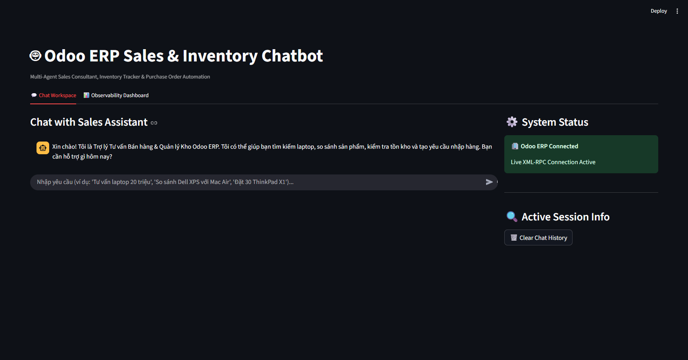
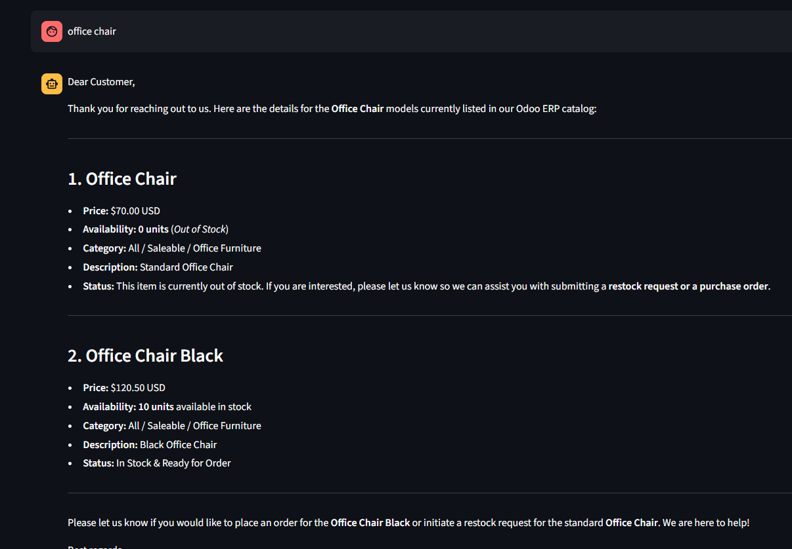
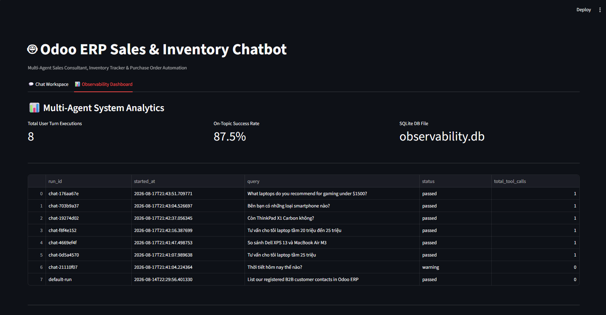

# 🤖 Systemic Multi Agent - Odoo ERP Sales Chatbot

### Multi-Agent Sales Consultant, Product Comparison, Inventory Tracker & Purchase Order Automation

---

## 🖼️ Application Screenshots & Demo

### 1. Interactive Chat Workspace (Product Advice & Odoo Catalog)




### 2. Markdown Product Comparison & Live Inventory Status


---

## 🌟 System Overview

**Systemic Multi Agent** is an enterprise-grade autonomous **ERP Sales & Inventory Chatbot** system built with **LangGraph**, **Gemini Flash**, **Odoo 17 ERP (XML-RPC)**, **SQLite**, and **Streamlit**.

The chatbot acts as an intelligent virtual sales consultant and inventory manager. It dynamically routes user intents to query live products, generate structured comparison tables, check real-time stock levels, and automatically create **Draft Purchase Orders (`purchase.order`)** directly on Odoo ERP for inventory staff to review and confirm.

```
User Chat Message
        │
        ▼
┌───────────────┐
│ Intent Router │ ← Structured Intent Classification (Gemini Flash)
└───────┬───────┘
        │
        ├── intent: "off_topic" ──────▶ Guardrail Node (Intercepts non-sales queries)
        │
        ├── intent: "product_inquiry" ──▶ Product Advisor Agent (Queries Odoo catalog & specs)
        │
        ├── intent: "product_comparison"▶ Product Advisor Agent (Generates comparison table)
        │
        ├── intent: "stock_check" ────▶ Inventory Checker Agent (Queries Odoo stock.quant)
        │
        └── intent: "restock_request" ─▶ Restock Agent (Creates draft Purchase Order on Odoo)
                                                │
                                                ▼
                                    SQLite Observability Log &
                                  Streamlit Chat Workspace UI
```

---

## ✨ Key Features

1. **Intent Router Agent (`agents/router.py`)**: Classifies incoming user messages into 5 distinct intents (`product_inquiry`, `product_comparison`, `stock_check`, `restock_request`, `off_topic`), extracting product names and purchase quantities.
2. **Product Advisor Agent (`agents/product_advisor.py`)**: Queries Odoo product catalog (`product.template`), presents prices and availability, and builds structured Markdown comparison tables.
3. **Inventory Checker Agent (`agents/inventory_checker.py`)**: Verifies real-time stock levels (`stock.quant`). If out of stock, proactively prompts the user to place a restock order.
4. **Restock & Purchase Order Agent (`agents/restock_agent.py`)**: Automatically generates **Draft Purchase Orders (`purchase.order`)** in Odoo ERP for staff approval.
5. **Guardrail Protection (`graph/workflow.py`)**: Intercepts off-topic messages (weather, general chitchat, coding questions) and redirects users back to sales assistance scope.
6. **LangGraph State Machine (`graph/workflow.py`)**: Manages non-linear agent execution and conversation memory (10-message sliding window).
7. **SQLite Observability Layer (`observability/logger.py`)**: Logs step-by-step agent trajectories, latencies, tool calls, and intent classifications into an SQLite database.
8. **Streamlit UI (`observability/dashboard.py`)**: Dual-tab UI featuring native Streamlit chat interface, session status sidebar, and observability analytics.
9. **Benchmark Evaluation Suite (`eval/`)**: Automated evaluation suite running 20 test scenarios to measure intent accuracy and guardrail effectiveness (`eval/run_eval.py`).

---

## 🛠️ Project Structure

```
Systemic Multi Agent/
├── agents/
│   ├── __init__.py
│   ├── router.py              # Intent classification & entity extraction
│   ├── product_advisor.py     # Product inquiry & comparison table advisor
│   ├── inventory_checker.py   # Real-time stock checker
│   └── restock_agent.py       # Draft Purchase Order creator
├── assets/
│   ├── demo1.png              # Chat Workspace screenshot
│   ├── demo2.png              # Product comparison & inventory screenshot
│   └── demo3.png              # Observability Dashboard screenshot
├── mcp_server/
│   ├── __init__.py
│   ├── search_tools.py        # Web search tools
│   └── odoo_tools.py          # Odoo 17 XML-RPC API client & tools
├── graph/
│   ├── __init__.py
│   ├── state.py               # ChatState TypedDict
│   └── workflow.py            # LangGraph state machine & routing
├── eval/
│   ├── __init__.py
│   ├── benchmark_questions.json # 20 chat evaluation scenarios
│   ├── metrics.py              # Intent accuracy & latency metrics
│   └── run_eval.py             # Benchmark execution runner
├── observability/
│   ├── __init__.py
│   ├── logger.py              # SQLite logging engine
│   └── dashboard.py          # Streamlit Chat App & Observability UI
├── guardrails/
│   ├── __init__.py
│   └── limits.py              # GuardrailConfig & limits
├── scripts/
│   └── seed_odoo_data.py      # Odoo ERP product & vendor seed script
├── utils/
│   ├── __init__.py
│   └── text.py                # Text formatting utilities
├── Dockerfile
├── docker-compose.yml
├── docker-compose.odoo.yml
├── .env.example
├── requirements.txt
└── README.md
```

---

## 🚀 Quick Start

### 1. Environment Setup

Clone repository and install dependencies:
```bash
python -m venv venv
# Windows:
venv\Scripts\activate
# Linux/macOS:
source venv/bin/activate

pip install -r requirements.txt
```

Create `.env` file from template:
```bash
cp .env.example .env
```
Fill in your `GOOGLE_API_KEY` (Get free key from [Google AI Studio](https://aistudio.google.com/)) and Odoo connection credentials (`ODOO_URL`, `ODOO_DB`, `ODOO_USER`, `ODOO_PASSWORD`).

### 2. Seed Odoo ERP Demo Data

```bash
python scripts/seed_odoo_data.py
```

### 3. Launch Streamlit Chat Application

```bash
python -m streamlit run observability/dashboard.py
```
Open your browser at `http://localhost:8501`.

### 4. Run Benchmark Evaluation

```bash
python eval/run_eval.py --limit 5
```

---

## 📊 Evaluation & Benchmark Metrics

| Metric | Description | Target |
|---|---|---|
| **Intent Accuracy Rate** | Percentage of user turns correctly routed to target node | **≥ 85%** |
| **Guardrail Effectiveness** | Percentage of off-topic messages correctly intercepted | **100%** |
| **Average Turn Latency** | Mean response time per chat turn | **< 2.0s** |
| **Restock Order Accuracy** | Percentage of draft Purchase Orders created with valid product IDs | **100%** |
