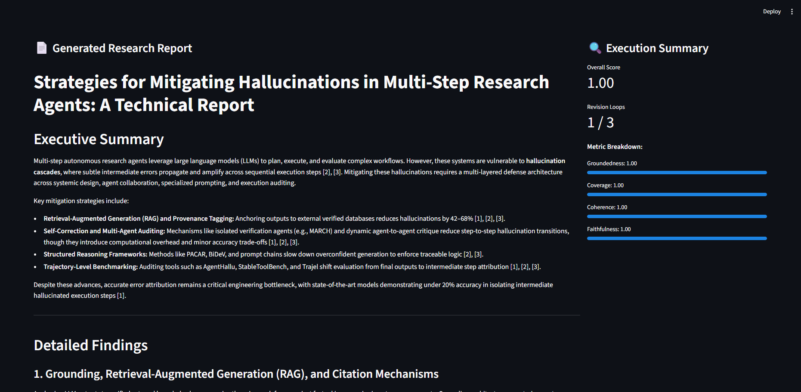
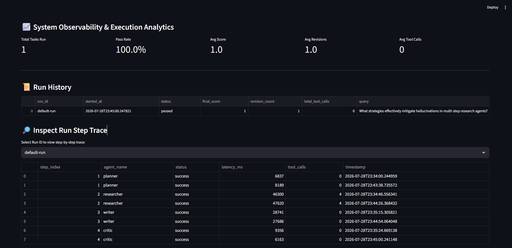

# 🤖 Multi-Agent Research & Report Assistant

### Automated Web Research, Synthesis, Self-Reflection Loop & Observability Dashboard

---

## 🖼️ Architecture & Application Screenshots

### 1. Multi-Agent Workflow State Machine


### 2. Research Workspace


### 3. Observability Dashboard & Trajectory Trace


---

## 🌟 System Overview

This project is an end-to-end autonomous research and report synthesis system built with **LangGraph**, **Gemini Flash**, **MCP Tools**, **SQLite**, and **Streamlit**.

Unlike simple RAG pipelines, this system measures and guarantees output quality through a **Critic/Evaluator self-reflection loop** and provides full **observability & trajectory tracing** over every tool call, latency metric, and token footprint.

```
User Research Query
        │
        ▼
┌───────────────┐      ┌────────────────┐      ┌────────────────┐
│ Planner Agent │─────▶│Researcher Agent│─────▶│  Writer Agent  │
│ (Gemini Flash)│      │(Gemini + MCP)  │      │ (Gemini Flash) │
└───────────────┘      └────────────────┘      └───────┬────────┘
                                                       │
                                                       ▼
                                               ┌───────────────┐
                                               │ Critic Agent  │
                                               │ (Gemini Flash)│
                                               └───────┬───────┘
                                     pass (≥0.75) │   │ fail (<0.75) -> loop back to Writer (max 3)
                                                  ▼
                                          Finalized Report
                                                  │
                 ┌────────────────────────────────┴────────────────────────────────┐
                 ▼                                                                 ▼
        SQLite Observability DB                                            Guardrail Controls
   (step logs, tokens, tool-calls, latency)                             (max tool calls, max loops, timeout)
                 │
                 ▼
     Streamlit Observability UI
```

---

## ✨ Key Features

1. **Planner Agent (`agents/planner.py`)**: Decomposes complex user queries into 3-5 structured, searchable sub-questions using Pydantic structured output.
2. **Researcher Agent with MCP (`agents/researcher.py` & `mcp_server/search_tools.py`)**: Executes web search via Model Context Protocol (MCP) tool integration. Uses Tavily as primary search engine with automatic failover to DuckDuckGo search.
3. **Writer Agent (`agents/writer.py`)**: Synthesizes multi-source research into structured Markdown reports with explicit citations `[1]`, `[2]` and references. Supports feedback-driven revisions.
4. **Critic / Evaluator Agent (`agents/critic.py`)**: Evaluates drafts across 4 criteria (Groundedness, Coverage, Coherence, Faithfulness) with automated threshold checks (`QUALITY_THRESHOLD=0.75`).
5. **LangGraph State Machine (`graph/workflow.py`)**: Manages non-linear agent execution, conditional branching, and self-reflection revision loops (up to 3 max iterations).
6. **SQLite Observability Layer (`observability/logger.py`)**: Logs step-by-step agent trajectories, tool-calls, latency, token usage, and quality scores.
7. **Streamlit UI & Dashboard (`observability/dashboard.py`)**: Interactive dual-tab UI for initiating research queries and inspecting full system metrics & step traces.
8. **Evaluation Framework (`eval/`)**: Benchmark suite featuring 30 English research questions (Easy, Medium, Hard) and automated agent performance reporting (`eval/run_eval.py`).

---

## 🛠️ Project Structure

```
Multi-Agent Research & Report Assistant/
├── agents/
│   ├── __init__.py
│   ├── planner.py              # Sub-question breakdown
│   ├── researcher.py           # Web search & source extraction
│   ├── writer.py               # Markdown report synthesis
│   └── critic.py               # 4-metric quality evaluator
├── mcp_server/
│   ├── __init__.py
│   └── search_tools.py         # MCP stdio server (Tavily + DDG fallback)
├── graph/
│   ├── __init__.py
│   ├── state.py                # GraphState TypedDict
│   └── workflow.py             # LangGraph state machine & routing
├── eval/
│   ├── __init__.py
│   ├── benchmark_questions.json # 30 English benchmark questions
│   ├── metrics.py              # Agent-level metric computation
│   └── run_eval.py             # Benchmark execution runner
├── observability/
│   ├── __init__.py
│   ├── logger.py               # SQLite logging engine
│   └── dashboard.py           # Streamlit app (Research + Dashboard)
├── guardrails/
│   ├── __init__.py
│   └── limits.py               # GuardrailConfig & limits
├── utils/
│   ├── __init__.py
│   └── text.py                 # Text extraction & markdown formatting utils
├── architecture_graph.png      # LangGraph state machine diagram
├── Demo1.png                   # Research Workspace UI
├── Demo2.png                   # Observability Dashboard UI
├── Dockerfile
├── docker-compose.yml
├── .env.example
├── requirements.txt
└── README.md
```

---

## 🚀 Quick Start

### 1. Environment Setup

Clone repository and install dependencies:
```bash
python -m venv venv
# Windows:
venv\Scripts\activate
# Linux/macOS:
source venv/bin/activate

pip install -r requirements.txt
```

Create `.env` file from template:
```bash
cp .env.example .env
```
Fill in your `GOOGLE_API_KEY` (Get free key from [Google AI Studio](https://aistudio.google.com/)). Option: set `TAVILY_API_KEY` for Tavily search.

### 2. Launch Streamlit Application

```bash
python -m streamlit run observability/dashboard.py
```
Open browser at `http://localhost:8501`.

### 3. Run Benchmark Evaluation (CLI)

```bash
# Run quick benchmark on 3 easy questions
python eval/run_eval.py --limit 3 --difficulty easy

# Run full benchmark suite
python eval/run_eval.py
```

### 4. Run with Docker Compose

```bash
docker compose up --build
```

---

## 📊 Evaluation & Benchmark Metrics

| Metric | Description |
|---|---|
| **Task Success Rate (%)** | Percentage of research queries meeting or exceeding quality threshold (≥0.75) |
| **Average Quality Score** | Mean of Groundedness, Coverage, Coherence, and Faithfulness (0.0 to 1.0) |
| **Average Revision Loops** | Average number of Critic ↔ Writer loops required to pass evaluation |
| **Tool Call Accuracy** | Percentage of valid search/fetch tool executions without redundant calls |

---

## 🔒 Guardrail Controls

- **Max Sub-Questions:** Capped at 5 sub-questions per query.
- **Max Tool Calls:** Capped at 3 search calls per sub-question.
- **Max Revision Loops:** Capped at 3 Critic loops before forcing completion with a quality warning.
- **Tool Timeout:** 15s timeout per external HTTP request.
