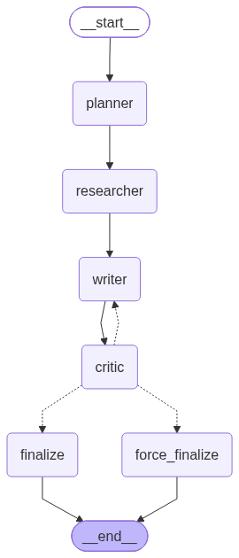

# 🤖 Multi-Agent Research & Report Assistant

### Autonomous Web Research, Odoo ERP Synthesis, Self-Reflection Loop & Observability Dashboard

---

## 🖼️ Architecture & Application Screenshots

### 1. Multi-Agent Workflow State Machine


### 2. Research Workspace (Hybrid Web & Odoo ERP Mode)


### 3. Observability Dashboard & Trajectory Trace


---

## 🌟 System Overview

This project is an enterprise-grade autonomous research and report synthesis system built with **LangGraph**, **Gemini Flash**, **Model Context Protocol (MCP)**, **Odoo 17 ERP**, **SQLite**, and **Streamlit**.

Unlike simple single-prompt RAG pipelines, this system combines **internal enterprise ERP data** (sales orders, revenue, inventory stock, customer accounts) with **external web research** (market trends, industry benchmarks, competitors) using a **hybrid routing architecture** and a **Critic/Evaluator self-reflection loop**.

```
User Query (Web / ERP / Hybrid)
        │
        ▼
┌───────────────┐      ┌────────────────┐      ┌────────────────┐
│ Planner Agent │─────▶│Researcher Agent│─────▶│  Writer Agent  │
│ (Gemini Flash)│      │(Web + MCP Odoo)│      │ (Gemini Flash) │
└───────────────┘      └────────────────┘      └───────┬────────┘
  (Classifies          (Routes queries to              │
   data_source:         Tavily/DDG or                  ▼
   web/erp/hybrid)      Odoo XML-RPC)          ┌───────────────┐
                                               │ Critic Agent  │
                                               │ (Gemini Flash)│
                                               └───────┬───────┘
                                     pass (≥0.75) │   │ fail (<0.75) -> loop back to Writer (max 3)
                                                  ▼
                                          Finalized Report
                                                  │
                 ┌────────────────────────────────┴────────────────────────────────┐
                 ▼                                                                 ▼
        SQLite Observability DB                                            Guardrail Controls
   (step logs, tokens, tool-calls, latency)                             (max tool calls, max loops, timeout)
                 │
                 ▼
     Streamlit Observability UI
```

---

## ✨ Key Features

1. **Hybrid Planner Agent (`agents/planner.py`)**: Decomposes complex queries into 3-5 sub-questions and classifies target data sources (`web`, `erp`, or `hybrid`) using Pydantic structured output.
2. **Dual MCP Tool Server (`mcp_server/search_tools.py` & `mcp_server/odoo_tools.py`)**: 
   - **Web Search Tools**: Tavily primary search with automatic failover to DuckDuckGo search.
   - **Odoo ERP Tools**: XML-RPC integration querying Odoo 17 sales orders (`query_sales`), inventory stock (`query_inventory`), and customer contact accounts (`query_customers`).
3. **Researcher Agent (`agents/researcher.py`)**: Dynamically routes sub-questions between Odoo ERP XML-RPC endpoints and web search API based on Planner classification.
4. **Hybrid Writer Agent (`agents/writer.py`)**: Synthesizes multi-source research into structured Markdown reports, explicitly distinguishing between **internal company performance** (`🏢 Internal ERP Data`) and **external market benchmarks** (`🌐 Web Source`) with citations.
5. **Critic / Evaluator Agent (`agents/critic.py`)**: Evaluates report drafts across 4 criteria (Groundedness, Coverage, Coherence, Faithfulness) with automated threshold checks (`QUALITY_THRESHOLD=0.75`).
6. **LangGraph State Machine (`graph/workflow.py`)**: Manages non-linear agent execution, conditional branching, and self-reflection revision loops (up to 3 max iterations).
7. **SQLite Observability Layer (`observability/logger.py`)**: Logs step-by-step agent trajectories, tool-calls, latency, token usage, and quality scores in an SQLite database.
8. **Streamlit UI & Dashboard (`observability/dashboard.py`)**: Dual-tab UI for initiating research queries (with real-time Odoo ERP connection status indicator) and inspecting full system metrics & step traces.
9. **Evaluation Framework (`eval/`)**: Benchmark suite featuring 40 research questions (30 Web + 10 Hybrid ERP) and automated agent performance reporting (`eval/run_eval.py`).

---

## 🛠️ Project Structure

```
Multi-Agent Research & Report Assistant/
├── agents/
│   ├── __init__.py
│   ├── planner.py              # Sub-question breakdown & data_source routing
│   ├── researcher.py           # Web search & Odoo ERP data extraction
│   ├── writer.py               # Markdown report synthesis with ERP/Web citations
│   └── critic.py               # 4-metric quality evaluator
├── assets/
│   ├── architecture_graph.png  # LangGraph state machine diagram
│   ├── Demo1.png                   # Research Workspace UI screenshot
│   └── Demo2.png                   # Observability Dashboard UI screenshot
├── mcp_server/
│   ├── __init__.py
│   ├── search_tools.py         # MCP stdio server (Tavily + DDG fallback)
│   └── odoo_tools.py           # MCP Odoo 17 XML-RPC query tools
├── graph/
│   ├── __init__.py
│   ├── state.py                # GraphState TypedDict
│   └── workflow.py             # LangGraph state machine & routing
├── eval/
│   ├── __init__.py
│   ├── benchmark_questions.json        # 30 English web benchmark questions
│   ├── benchmark_questions_hybrid.json # 10 Hybrid ERP benchmark questions
│   ├── metrics.py                      # Agent-level metric computation
│   └── run_eval.py                     # Benchmark execution runner
├── observability/
│   ├── __init__.py
│   ├── logger.py               # SQLite logging engine
│   └── dashboard.py           # Streamlit app (Research + Dashboard + ERP status)
├── guardrails/
│   ├── __init__.py
│   └── limits.py               # GuardrailConfig & limits
├── scripts/
│   └── seed_odoo_data.py       # Odoo ERP demo data seed script
├── utils/
│   ├── __init__.py
│   └── text.py                 # Text extraction & markdown formatting utils
├── Dockerfile
├── docker-compose.yml
├── .env.example
├── requirements.txt
└── README.md
```

---

## 🚀 Quick Start

### 1. Environment Setup

Clone repository and install dependencies:
```bash
python -m venv venv
# Windows:
venv\Scripts\activate
# Linux/macOS:
source venv/bin/activate

pip install -r requirements.txt
```

Create `.env` file from template:
```bash
cp .env.example .env
```
Fill in your `GOOGLE_API_KEY` (Get free key from [Google AI Studio](https://aistudio.google.com/)). Option: set `TAVILY_API_KEY` for Tavily search and `ODOO_*` variables for Odoo ERP connection.

### 2. Launch Streamlit Application

```bash
python -m streamlit run observability/dashboard.py
```
Open browser at `http://localhost:8501`.

### 3. Seed Odoo ERP Demo Data (Optional)

```bash
python scripts/seed_odoo_data.py
```

### 4. Run Benchmark Evaluation (CLI)

```bash
# Run Web Benchmark
python eval/run_eval.py --limit 3 --difficulty easy

# Run Hybrid ERP Benchmark
python eval/run_eval.py --file benchmark_questions_hybrid.json
```

### 5. Run with Docker Compose (App + Odoo 17 + PostgreSQL)

```bash
docker compose up --build
```

---

## 📊 Evaluation & Benchmark Metrics

| Metric | Description |
|---|---|
| **Task Success Rate (%)** | Percentage of research queries meeting or exceeding quality threshold (≥0.75) |
| **Average Quality Score** | Mean of Groundedness, Coverage, Coherence, and Faithfulness (0.0 to 1.0) |
| **Average Revision Loops** | Average number of Critic ↔ Writer loops required to pass evaluation |
| **Tool Call Accuracy** | Percentage of valid search/fetch/ERP tool executions without redundant calls |

---

## 🔒 Guardrail Controls

- **Max Sub-Questions:** Capped at 5 sub-questions per query.
- **Max Tool Calls:** Capped at 3 search calls per sub-question.
- **Max Revision Loops:** Capped at 3 Critic loops before forcing completion with a quality warning.
- **Tool Timeout:** 15s timeout per external HTTP request.
